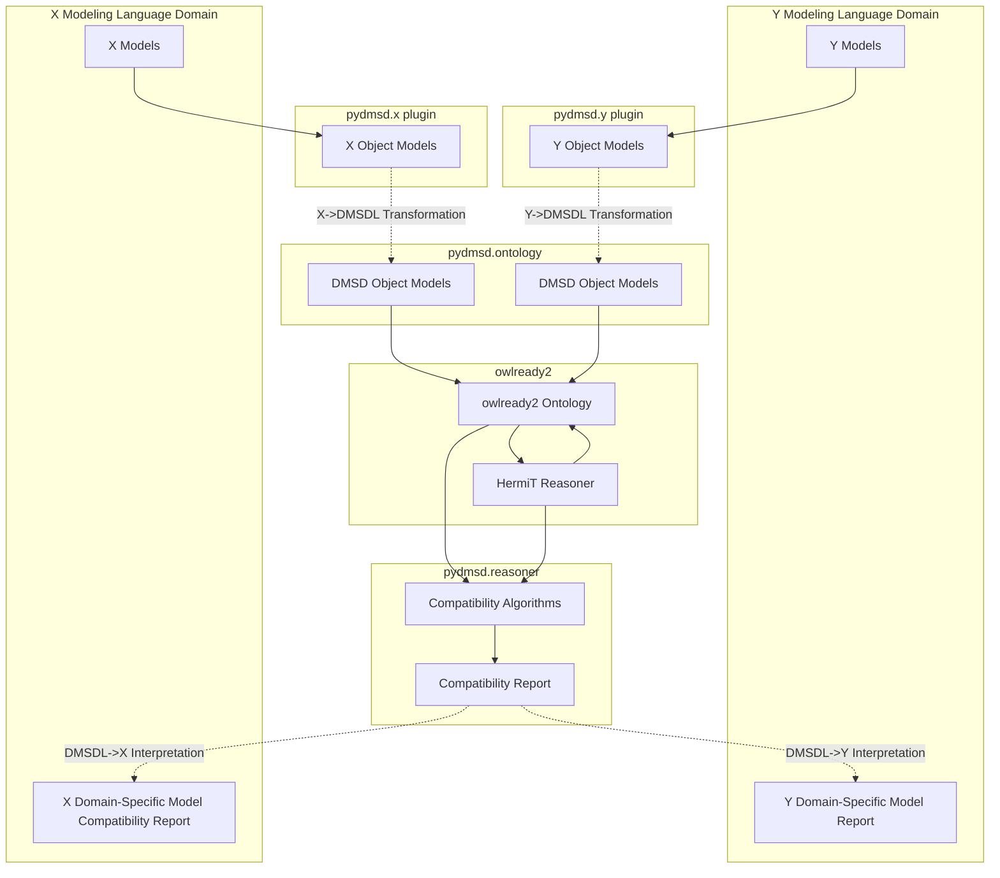

# pydmsd

**pydmsd** (DMSD = Data Modeling for System Design) is a Python library aiming to solve a key problem
in systems integration - detecting compatibility between messages exchanged between software interfaces.

The approach taken is to use an OWL ontology as a **semantic data model** that captures the structure and semantics
of messages exchanged between systems. The well-defined semantics of OWL ontologies supports a formal approach
to modeling and the use of off-the-shelf ontology reasoners to detect incompatibilities between messages.

## Features

- Create a message model (ontology) via a simple abstraction over owlready2
- Reason over OWL ontologies (via OWLready2 + HermiT) to detect incompatibilities between messages
- Detect unsatisfiable message classes
- Explain _why_ message classes are unsatisfiable (enumerate message incompatibilities)
- Import and export OWL ontologies in various formats
- Create (or import) FACE and FHIR data models and transform them to OWL ontologies for incompatibility detection

---

## Incompatibility Detection (Reasoning)

The library supports detection of the following types of incompatibilities between message classes:

### 1. **Cardinality Conflicts**
When two message classes have conflicting min/max cardinality restrictions on the same property.

> Example:
> - `Helicopter` requires `rotorSpeed` exactly 1
> - `Quadrotor` requires `rotorSpeed` exactly 4
> → Incompatible (unsatisfiable intersection due to cardinality conflict)


### 2. **Property Presence Differences (Closed World Assumption)**
When one message class requires a property that is not present in another the other,
the message is intuitively incompatible, because one requires a property the other does not have.
under OWL's open world semantics, they are **not disjoint** — but we apply a **closed world assumption**
to the intersection of the two classes so that disjointness inference can match our intuition.

> Example:
> - `USPatient` must have `socialSecurityNumber`
> - `NHSPatient` does not define that property
> → Incompatible (unsatisfiable intersection under closed world assumption)


### 3. **Property Range Incompatibility Violations (TODO)**
If the same property has different value types (e.g., `X` vs `Y`),
the classes are incompatible unless one is a subclass of the other.

> Example:
> - `A.p : X`
> - `B.p : Y` (`X` not a subclass of `Y`)
> → Incompatible due to conflicting property range requirements


### 4. **Datatype Incompatibility (TODO)**
Incompatible datatypes for the same property (e.g., `str` vs `int`).

> Example:
> - `A.p : int`
> - `B.p : str`
> → Incompatible due to conflicting property range requirements


### 5. **Measurement System/Unit Incompatibility (TODO)**
When two message classes use the same property but with non-convertible units of measure,
the classes are incompatible. The semantics of measurement systems are not part of OWL,
but we can use measurement ontologies like the Ontology of Units of Measure (OM) to extend
the basic OWL-based definition of message classes, which allows us to reason about
incompatibilities due to non-convertible units/systems of measurement.

> Example:
> - `A.temperature` in Fahrenheit
> - `B.temperature` in Celsius
> → Compatible

> Example:
> - `A.temperature` (Temperature)
> - 
> - `B.speed` (Speed)
> → Incompatible


## Directory Structure

pydmsd/
├── ontology/
│ ├── types.py # core ontology modeling layer
│ └── reasoner.py # compatibility detection and explanation
├── face/
│ ├── types.py # domain model for FACE models and mapping to core ontology model
│ └── io.py # (TODO) Import/export for standard model files
├── fhir/
│ ├── types.py # domain model for FHIR models and mapping to core ontology model
│ └── io.py # (TODO) Import/export for standard FHIR model files
├── examples/ # examples illustrating various compatibiligy scenarios
│ └── face_cardinality.py

## Dataflow Diagram (Generic Plugins)


## Dataflow Diagram (FACE Plugins)
```mermaid
%% Used mermaidchart.com to get styling right
flowchart TD

  %% Subgraph definitions
  subgraph pydmsd.face_plugin ["pydmsd.face plugin"]
    FACE_OBJ[FACE Object Models]:::paleBlue
  end

  subgraph FACE_Domain ["FACE Domain"]
    FACE[FACE Models]:::paleBlue
    FACE_REPORT[FACE Report]:::paleBlue
  end

  subgraph pydmsd.ontology ["pydmsd.ontology"]
    ONT_OBJ1[DMSD Object Models]:::paleBlue
    ONT_OBJ2[DMSD Object Models]:::paleBlue
  end

  subgraph owlready2 ["owlready2"]
    OWL[owlready2 Ontology]:::paleBlue
    HERMIT[HermiT Reasoner]:::paleBlue
    OWL --> HERMIT
    HERMIT --> OWL
  end

  subgraph pydmsd.reasoner ["pydmsd.reasoner"]
    COMPAT[Compatibility Algorithms]:::paleBlue
    COMPAT_REPORT[Compatibility Report]:::paleBlue
    COMPAT --> COMPAT_REPORT
  end

  FACE_REPORT[FACE Model Compatibility Report]:::paleBlue
  FACE --> FACE_OBJ
  ONT_OBJ1 --> OWL
  FACE_OBJ -.->|FACE->DMSDL Transformation| ONT_OBJ1
  OWL --> COMPAT
  COMPAT_REPORT -.->|DMSDL->FACE Interpretation| FACE_REPORT
  HERMIT --> COMPAT

  %% "Trick" node for subgraph header coloring (place behind all other nodes)
  style pydmsd.face_plugin fill:#ffffcc,stroke:#ffaa00,stroke-width:2px
  style FACE_Domain fill:#ffffcc,stroke:#ffaa00,stroke-width:2px
  style pydmsd.ontology fill:#ffffcc,stroke:#ffaa00,stroke-width:2px
  style owlready2 fill:#ffffcc,stroke:#ffaa00,stroke-width:2px
  style pydmsd.reasoner fill:#ffffcc,stroke:#ffaa00,stroke-width:2px

  classDef paleBlue fill:#e0eeff,stroke:#333,stroke-width:2px;
  ```

## Dataflow Diagram (FHIR Plugins)
```mermaid
%% Used mermaidchart.com to get styling right
flowchart TD

  subgraph pydmsd.fhir_plugin["pydmsd.FHIR plugin"]
    FHIR_OBJ[FHIR Object Models]
    class FHIR_OBJ paleBlue;
  end

  subgraph FHIR_Domain["FHIR Domain"]
    FHIR[FHIR Models]
    FHIR_REPORT[FHIR Report]
    class FHIR paleBlue;
    class FHIR_REPORT paleBlue;
  end

  subgraph pydmsd.ontology
    ONT_OBJ1[DMSD Object Models]
    ONT_OBJ2[DMSD Object Models]
    class ONT_OBJ1 paleBlue;
    class ONT_OBJ2 paleBlue;
  end

  subgraph owlready2
    OWL[owlready2 Ontology]
    HERMIT[HermiT Reasoner]
    class OWL paleBlue;
    class HERMIT paleBlue;
    OWL --> HERMIT
    HERMIT --> OWL
  end

  subgraph pydmsd.reasoner
      COMPAT[Compatibility Algorithms]
      COMPAT_REPORT[Compatibility Report]
      class COMPAT paleBlue;
      class COMPAT_REPORT paleBlue;
      COMPAT --> COMPAT_REPORT
  end

  FHIR_REPORT[FHIR Profile Interoperability Report]

  FHIR --> FHIR_OBJ

  ONT_OBJ1 --> OWL

  FHIR_OBJ -.->|FHIR->DMSDL Transformation| ONT_OBJ1

  OWL --> COMPAT
  COMPAT_REPORT -.->|DMSDL->FHIR Interpretation| FHIR_REPORT
  HERMIT --> COMPAT

  %% Subgraph backgrounds
  style pydmsd.fhir_plugin fill:#ffffcc,stroke:#ffaa00,stroke-width:2px
  style FHIR_Domain fill:#ffffcc,stroke:#ffaa00,stroke-width:2px
  style pydmsd.ontology fill:#ffffcc,stroke:#ffaa00,stroke-width:2px
  style owlready2 fill:#ffffcc,stroke:#ffaa00,stroke-width:2px
  style pydmsd.reasoner fill:#ffffcc,stroke:#ffaa00,stroke-width:2px

  %% Node class
  classDef paleBlue fill:#e0eeff,stroke:#333,stroke-width:2px;

  ```
