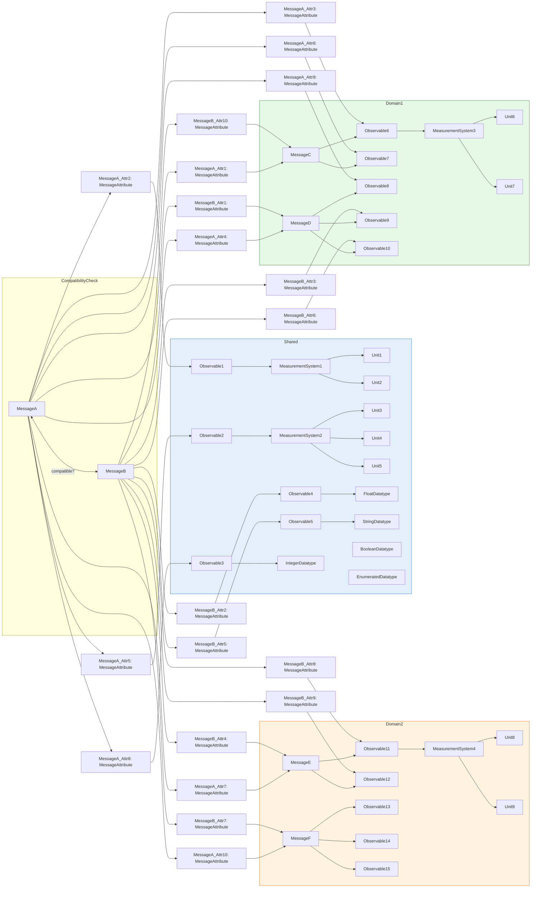

```mermaid
flowchart LR
  %% Shared Domain (Blue)
  subgraph Shared
    direction TB
    style Shared fill:#e3f0fc,stroke:#1976d2
    Obs1[Observable1]
    Obs2[Observable2]
    Obs3[Observable3]
    Obs4[Observable4]
    Obs5[Observable5]
    MS1[MeasurementSystem1]
    MS2[MeasurementSystem2]
    U1[Unit1]
    U2[Unit2]
    U3[Unit3]
    U4[Unit4]
    U5[Unit5]
    Dat1[IntegerDatatype]
    Dat2[FloatDatatype]
    Dat3[StringDatatype]
    Dat4[BooleanDatatype]
    Dat5[EnumeratedDatatype]
    Obs1 --> MS1
    Obs2 --> MS2
    MS1 --> U1
    MS1 --> U2
    MS2 --> U3
    MS2 --> U4
    MS2 --> U5
    Obs3 --> Dat1
    Obs4 --> Dat2
    Obs5 --> Dat3
  end

  %% Domain 1 (Green)
  subgraph Domain1
    direction TB
    style Domain1 fill:#e6f9e6,stroke:#2e7d32
    Obs6[Observable6]
    Obs7[Observable7]
    Obs8[Observable8]
    Obs9[Observable9]
    Obs10[Observable10]
    MS3[MeasurementSystem3]
    U6[Unit6]
    U7[Unit7]
    MsgC[MessageC]
    MsgD[MessageD]
    Obs6 --> MS3
    MS3 --> U6
    MS3 --> U7
    MsgC --> Obs6
    MsgC --> Obs7
    MsgD --> Obs8
    MsgD --> Obs9
    MsgD --> Obs10
  end

  %% Domain 2 (Orange)
  subgraph Domain2
    direction TB
    style Domain2 fill:#fff3e0,stroke:#ef6c00
    Obs11[Observable11]
    Obs12[Observable12]
    Obs13[Observable13]
    Obs14[Observable14]
    Obs15[Observable15]
    MS4[MeasurementSystem4]
    U8[Unit8]
    U9[Unit9]
    MsgE[MessageE]
    MsgF[MessageF]
    Obs11 --> MS4
    MS4 --> U8
    MS4 --> U9
    MsgE --> Obs11
    MsgE --> Obs12
    MsgF --> Obs13
    MsgF --> Obs14
    MsgF --> Obs15
  end

  %% MessageA and MessageB at the bottom
  subgraph CompatibilityCheck
    direction TB
    MessageA[MessageA]
    MessageB[MessageB]
    MessageA <-->|"compatible?"| MessageB
  end

  %% MessageA Attributes
  A_attr1[MessageA_Attr1: MessageAttribute]
  A_attr2[MessageA_Attr2: MessageAttribute]
  A_attr3[MessageA_Attr3: MessageAttribute]
  A_attr4[MessageA_Attr4: MessageAttribute]
  A_attr5[MessageA_Attr5: MessageAttribute]
  A_attr6[MessageA_Attr6: MessageAttribute]
  A_attr7[MessageA_Attr7: MessageAttribute]
  A_attr8[MessageA_Attr8: MessageAttribute]
  A_attr9[MessageA_Attr9: MessageAttribute]
  A_attr10[MessageA_Attr10: MessageAttribute]

  %% MessageB Attributes
  B_attr1[MessageB_Attr1: MessageAttribute]
  B_attr2[MessageB_Attr2: MessageAttribute]
  B_attr3[MessageB_Attr3: MessageAttribute]
  B_attr4[MessageB_Attr4: MessageAttribute]
  B_attr5[MessageB_Attr5: MessageAttribute]
  B_attr6[MessageB_Attr6: MessageAttribute]
  B_attr7[MessageB_Attr7: MessageAttribute]
  B_attr8[MessageB_Attr8: MessageAttribute]
  B_attr9[MessageB_Attr9: MessageAttribute]
  B_attr10[MessageB_Attr10: MessageAttribute]

  %% Attribute links
  MessageA --> A_attr1
  MessageA --> A_attr2
  MessageA --> A_attr3
  MessageA --> A_attr4
  MessageA --> A_attr5
  MessageA --> A_attr6
  MessageA --> A_attr7
  MessageA --> A_attr8
  MessageA --> A_attr9
  MessageA --> A_attr10

  MessageB --> B_attr1
  MessageB --> B_attr2
  MessageB --> B_attr3
  MessageB --> B_attr4
  MessageB --> B_attr5
  MessageB --> B_attr6
  MessageB --> B_attr7
  MessageB --> B_attr8
  MessageB --> B_attr9
  MessageB --> B_attr10

  %% Attribute type references
  A_attr1 --> MsgC
  A_attr2 --> Obs1
  A_attr3 --> Obs6
  A_attr4 --> MsgD
  A_attr5 --> Obs2
  A_attr6 --> Obs7
  A_attr7 --> MsgE
  A_attr8 --> Obs3
  A_attr9 --> Obs8
  A_attr10 --> MsgF

  B_attr1 --> MsgD
  B_attr2 --> Obs4
  B_attr3 --> Obs9
  B_attr4 --> MsgE
  B_attr5 --> Obs5
  B_attr6 --> Obs10
  B_attr7 --> MsgF
  B_attr8 --> Obs11
  B_attr9 --> Obs12
  B_attr10 --> MsgC

```