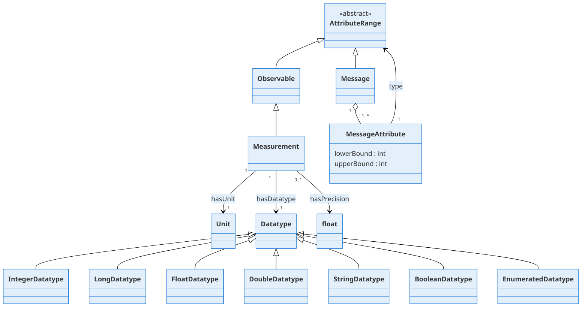

# Data Modeling Language

## OWL Model (Manchester Syntax) represented in `types.py`

```manchester
Class: dsdm:Message

Class: dsdm:Observable

ObjectProperty: dsdm:MessageAttribute
  Domain: dsdm:Message
  Range: dsdm:Message or dsdm:Observable

Class: dsdm:Unit

DatatypeProperty: dsdm.hasPrecision
  Domain: dsdm:Measurement
  Range: xsd:float

ObjectProperty: dsdm.hasUnit
  Domain: dsdm:Measurement
  Range: dsdm:Unit


Class: dsdm:Measurement
  SubClassOf:
    dsdm:hasUnit exactly 1,
    dsdm:hasPrecision max 1
    dsdm:hasDatatype exactly 1

Class: dsdm:Datatype

Class: dsdm:IntegerDatatype
  SubClassOf: dsdm:Datatype

Class: dsdm:LongDatatype
  SubClassOf: dsdm:Datatype

Class: dsdm:FloatDatatype
  SubClassOf: dsdm:Datatype

Class: dsdm:DoubleDatatype
  SubClassOf: dsdm:Datatype

Class: dsdm:StringDatatype
  SubClassOf: dsdm:Datatype

Class: dsdm:BooleanDatatype
  SubClassOf: dsdm:Datatype

Class: dsdm:EnumeratedDatatype
  SubClassOf: dsdm:Datatype

DisjointClasses:
  IntegerDatatype,
  FloatDatatype,
  DoubleDatatype,
  StringDatatype,
  BooleanDatatype,
  EnumeratedDatatype
```


# Language Diagram
